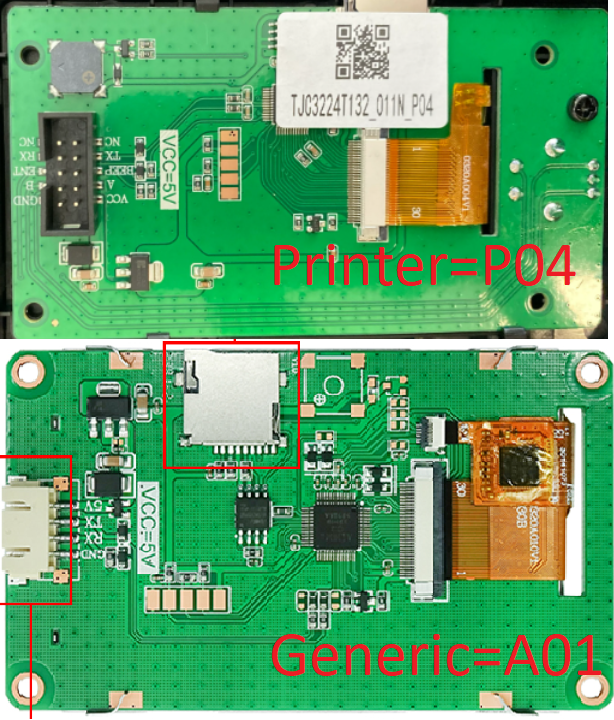
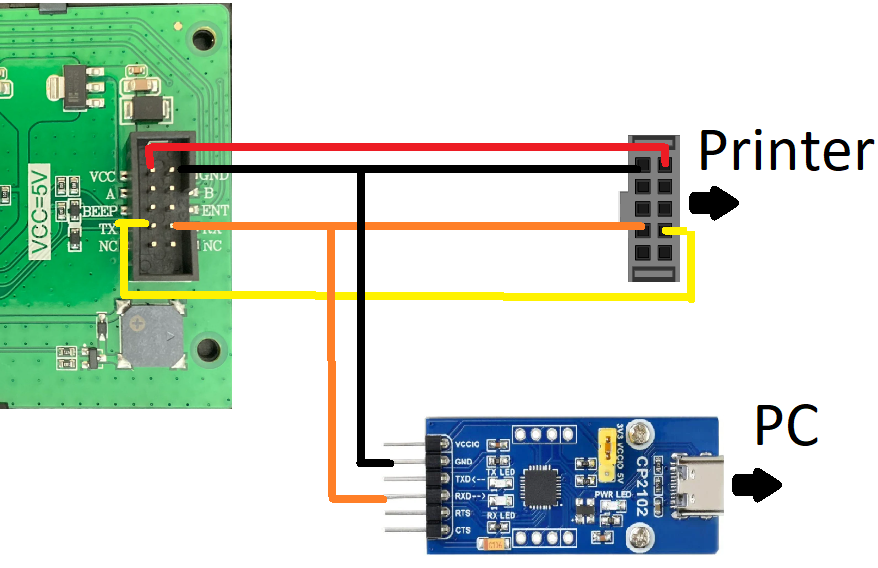
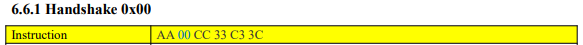
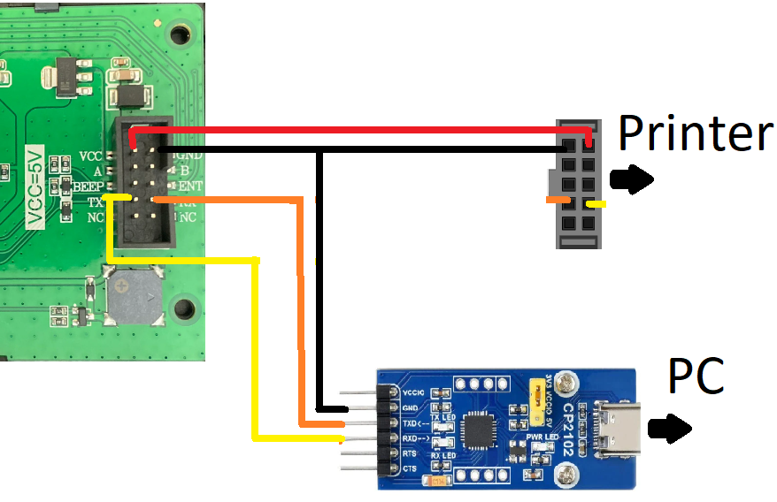

# Reverse engineering the printer communication with display

The Creality Ender 3 V3 SE printer employs a display from TJC ([Taojin Chi](https://www.tjc1688.com/)) with the model number **TJC3224T132_011N_P04**. This was verified through examination of the manufacturer's website, particularly comparing it with a similar product, the [TJC3224T132_011N_A01](https://www.tjc1688.com/contents/7/136.html):



Uncovering information about Chinese electronics is a challenge, but indications suggest that the Creality display is a customized version of the generic display, incorporating additional features such as buttons and a buzzer. More information such as libraries or instruction set could not be found. Consequently, the only viable approach to decipher the communication protocol involves simulating the UART connection between the printer and the display. To achieve this, a USB-UART converter was employed, as illustrated




Typically, displays, including this one, communicate at 115200 baud by default. Upon powering up the printer, the following messages were transmitted from the printer to the display:

```
AA 00 CC 33 C3 3C
```

With this information and a brief search, a [document that describes the instruction set of another display with similar protocol](https://www.dwin-global.com/uploads/T5L_TA-Instruction-Set-Development-Guide.pdf) was found. By logging communication during menu navigation, it was confirmed that most instructions align, but not entirely.



After that, it is a only a matter of listening to the communication while using the printer and understand how it works.This is achieved by replicating the same commands sent by the printer via a computer, configured as follows:



Note that the screen is still being powered by the printer. You can replace this by another 5V source, but (usually) not directly from the USB Serial converter, as it can't provide enough current to the display. 

For example, the messages that the printer sends to the display when booting are:

```py
# Turning printer On
AA 00 CC 33 C3 3C
AA 3D CC 33 C3 3C
# Drawing "creality" bootscreen is a sequence of commands
AA 97 00 14 00 60 1B 01 00 08 CC 33 C3 3C  
...
AA 97 00 14 00 60 1B 01 00 35 CC 33 C3 3C 
# Set background color to grey
AA 40 11 45 FF FF CC 33 C3 3C  
# Draw rectangle for the screen header
AA 5B 00 00 00 00 00 EF 00 18 CC 33 C3 3C 
# Set background color to black
AA 40 08 41 FF FF CC 33 C3 3C 
# Draw a dark grey background rectangle
AA 5B 00 00 00 19 00 EF 01 3F CC 33 C3 3C
# Draw "main" icon on header
AA 97 00 1D 00 01 06 00 00 01 CC 33 C3 3C 
# draw top left rectangle (print icon)
AA 97 00 0C 00 33 02 01 00 02 CC 33 C3 3C 
# Set color to white # 
AA 40 FF FF FF FF CC 33 C3 3C 
# draw white rectangle around top left grey rectangle
AA 59 00 0C 00 33 00 71 00 A5 CC 33 C3 3C 
# draw "print" text as icon on top left rectangle
AA 97 00 0D 00 78 06 00 00 08 CC 33 C3 3C 
# draw top right rectangle (prepare icon)
AA 97 00 7E 00 33 02 01 00 03 CC 33 C3 3C 
# draw "prepare" text as icon on top right
AA 97 00 7F 00 78 06 00 00 03 CC 33 C3 3C 
# bottom left rectangle (control icon)
AA 97 00 0C 00 B2 02 01 00 05 CC 33 C3 3C 
# "control" text on bottom left
AA 97 00 0D 00 F7 06 00 00 04 CC 33 C3 3C 
# bottom right rectangle (leveling icon)
AA 97 00 7E 00 B2 02 01 00 07 CC 33 C3 3C 
# "Leveling" text on bottom right
AA 97 00 7F 00 F7 06 00 00 0E CC 33 C3 3C 
```


## Icon Library findings:

Within the tools directory, a Python script has been made to iterate through all potential icons. This script serves the purpose of mapping each icon to its corresponding library and icon IDs, facilitating the identification of respective addresses. The script's functionality automates the process of associating icons with their specific library and ID combination, so that the respective addresses were found:

Library goes from 0 to 65 ( 6 bits)

|Language   |Lib_id   |
|---|---|
| Icons  | 0  |
| Chinese  |  2 |
| English  |  4 |
| German  |  6 |
| Russian  |  9 |
| French |  12 |
| Turkish  | 15  |
| Spanish  | 17  |
| Italian  | 19  |
| Portuguese  | 21  |
| Japanese  |  23 |
| Korean  |  25 |
| Gifs  |  27 |


# Differences in the instruction set:

Unfortunately the instruction set found is only similar, but no the same as the one from the display. Some of the instructions does not work (QR, move page, and so on) and we need to double check how the original firmware does it, again by plugging our serial man in the middle and checking what happens, like in:

``` 

--end of screen, here the magic should happen:
AA 09 82 00 24 08 41 00 0B 00 19 00 EF 00 F0 CC 33 C3 3C -- This is the command that moves a part of the screen
-- What happens here? let´s break it down:
AA: header
09: cut screen command
82: ? Probably a mode 80 | direction? 0x02 is top, 0x03 is down. Where is left and right?
0024: Y offset (36)
0841: no idea, is a background color
000B: X0 (11)
0019: Y0 (25)
00EF: X1 (239)
00F0: Y1 (240)

```
Confirmation can be achieved by altering X0, Y0, X1, and Y1 and observing the screen. The same applies to other unknown parameters. Changing 0x82 to 0x81 does not move the screen, but changing it to 0x83 makes it move down. 


## Other important information

DISPLAY UART IS LOCATED ON PIN PA3,2 (USART 2)
SERIAL_BRIDGE_CONFIG_USART2_PA3,PA2